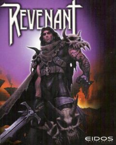

# Revenant (1999) - Parche de Traducción al Español

<div align="center">
  
</div>

## Descripción

Este proyecto contiene una traducción no oficial del juego **Revenant** (1999) de Cinematix Studios/Eidos Interactive al español.

## Estado del Proyecto

❌ **INCOMPLETO** - La traducción está en desarrollo activo

<!-- TODO:
## Instalación
1. Descarga los archivos de traducción
-->

## Estructura del Proyecto

```
├── translations/
│   └── english.def         # Archivo original en inglés (referencia)
├── README.md               # Este archivo
└── changelog.md            # Notas de trabajo en progreso
```

## Contribuciones

Este es un proyecto de traducción comunitaria. Si deseas contribuir:

1. Fork del repositorio
2. Crea una rama para tu contribución
3. Realiza tus cambios
4. Envía un Pull Request

## Notas Técnicas

- El juego utiliza archivos `.def` para las traducciones
- Cada línea sigue el formato: `CLAVE "Texto traducido"`
- Las claves deben mantenerse exactamente igual que en el archivo original
- Los comentarios de los desarrolladores se mantienen originales.

## Herramienta de Verificación

### analyze_keys.py

Script para verificar la integridad estructural de los archivos de traducción.

**¿Para qué sirve?**
- Detecta keys faltantes o extra en la traducción
- Identifica duplicados incorrectos (las keys duplicadas son fallbacks necesarios)

**Cómo ejecutarlo:**
```bash
python analyze_keys.py
```

**Cuándo usarlo:**
- ⚠️ **ANTES** de instalar cualquier traducción
- Después de editar manualmente el archivo `english.def`
- Para verificar que la estructura coincide con el original

El script compara `english_original.def` con `english.def` y muestra un reporte detallado de diferencias.

## Licencia

Este proyecto está bajo la Licencia MIT. Ver el archivo [LICENSE](LICENSE) para más detalles.

**Aclaración importante**: Este proyecto de traducción es no oficial y no está afiliado con Cinematix Studios. El juego original Revenant es propiedad de sus respectivos dueños.

## Autor

**Pedro Yanez**

[](https://github.com/wotanCode)
[](https://www.youtube.com/channel/UCwISu2hFg7EpOIZ8aV7iS6g?sub_confirmation=1)
[](https://www.linkedin.com/in/pedro-yanez/)

## Créditos

- **Juego Original**: Cinematix Studios (1998)
- **Publicado por**: Eidos Interactive (1999)